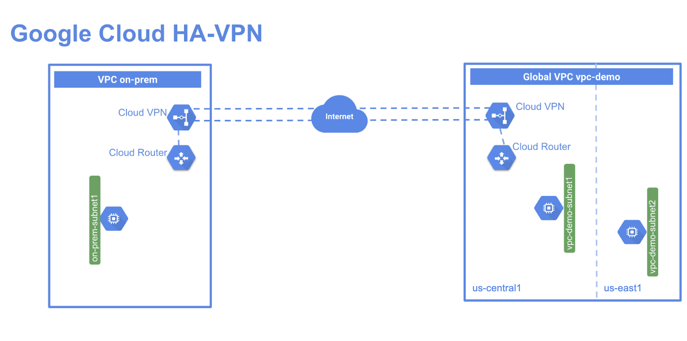

# Mettre en place une interconnexion avec un VPN HA au format GCLOUD et à la mano

## Présentation

Un VPN haute disponibilité est une solution Cloud VPN offrant une disponibilité élevée. Ce type de VPN vous permet de connecter en toute sécurité votre réseau local à votre réseau de cloud privé virtuel (VPC) via une connexion VPN IPsec située dans une seule région. Les VPN haute disponibilité garantissent un taux de disponibilité de 99,99 %.

Le VPN haute disponibilité est une solution VPN régionale et par VPC. Les passerelles VPN haute disponibilité possèdent deux interfaces, chacune ayant sa propre adresse IP publique. Lorsque vous créez une passerelle VPN haute disponibilité, deux adresses IP publiques sont automatiquement sélectionnées dans différents pools d'adresses. Lorsque le VPN haute disponibilité est configuré avec deux tunnels, Cloud VPN offre un taux de disponibilité de 99,99 %.

Dans cet atelier, vous allez créer un VPC mondial nommé vpc-demo, avec deux sous-réseaux personnalisés dans us-east1 et us-central1. Dans ce VPC, vous ajouterez une instance Compute Engine dans chaque région. Vous créerez ensuite un second VPC nommé on-prem pour simuler le centre de données sur site d'un client. Dans ce second VPC, vous ajouterez un sous-réseau dans la région us-central1 et une instance Compute Engine exécutée dans cette région. Enfin, vous ajouterez un VPN haute disponibilité et un routeur cloud dans chaque VPC, puis exécuterez deux tunnels à partir de chaque passerelle VPN haute disponibilité avant de tester la configuration pour vérifier que le contrat de niveau de service atteint 99,99 %.



## Objectifs

Dans cet atelier, vous allez apprendre à effectuer les tâches suivantes :

- Créer deux instances et réseaux VPC
- Configurer des passerelles VPN haute disponibilité
- Configurer le routage dynamique avec les tunnels VPN
- Configurer le mode de routage dynamique global
- Vérifier et tester la configuration de la passerelle VPN haute disponibilité

## Tableau de variables contenant les valeurs associées à votre projet

| Variables         | Valeurs                             |
| ----------------- |:-----------------------------------:|
| $VPC_NAME         | vpc-demo                            |
| $ONPREM_NAME      | on-prem                             |
| $REGION1          | us-central1                         |
| $REGION2          | us-east1                            |
| $ZONE1A           | us-central1-a                       |
| $ZONE1B           | us-central1-b                       |
| $ZONE2            | us-east1-b                          |
| $VPC_SUBNET1      | vpc-demo-subnet1                    |
| $VPC_SUBNET2      | vpc-demo-subnet2                    |
| $ONP_SUBNET       | on-prem-subnet1                     |
| $VPC_FW_AL_CU     | vpc-demo-allow-custom               |
| $VPC_FW_ICMP      | vpc-demo-allow-ssh-icmp             |
| $ONP_FW_AL_CU     | on-prem-allow-custom                |
| $ONP_FW_ICMP      | on-prem-allow-ssh-icmp              |
| $VPC_VM1          | vpc-demo-instance1                  |
| $VPC_VM2          | vpc-demo-instance2                  |
| $ONP_VM1          | on-prem-instance1                   |
| $VPC_VPN_GW1      | vpc-demo-vpn-gw1                    |
| $ONP_VPN_GW1      | on-prem-vpn-gw1                     |
| $VPC_ROUTER       | vpc-demo-router1                    |
| $ONP_ROUTER       | on-prem-router1                     |
| $VPC_TUNNEL0      | vpc-demo-tunnel0                    |
| $VPC_TUNNEL1      | vpc-demo-tunnel1                    |
| $ONP_TUNNEL0      | on-prem-tunnel0                     |
| $ONP_TUNNEL1      | on-prem-tunnel1                     |
| $ONP_SUB_FROM_VPC | on-prem-allow-subnets-from-vpc-demo |
| $VPC_SUB_FROM_ONP | vpc-demo-allow-subnets-from-on-prem |
| $ONP_BGP_TUNNEL0  | bgp-on-prem-tunnel0                 |
| $ONP_BGP_TUNNEL1  | bgp-on-prem-tunnel1                 |
| $VPC_BGP_TUNNEL0  | bgp-vpc-demo-tunnel0                |
| $VPC_BGP_TUNNEL1  | bgp-vpc-demo-tunnel1                |
| $VPC_INTERFACE_T0 | if-tunnel0-to-on-prem               |
| $VPC_INTERFACE_T1 | if-tunnel1-to-on-prem               |
| $ONP_INTERFACE_T0 | if-tunnel0-to-vpc-demo              |
| $ONP_INTERFACE_T1 | if-tunnel1-to-vpc-demo              |


## Mise en place d'un VPC sur Google Cloud

Configuration d'un VPC mondial avec deux sous-réseaux personnalisés et deux instances de VM s'exécutant dans chaque zone.

### Setup d'un Global VPC

```
gcloud compute networks create $VPC_NAME --subnet-mode custom
```

### Setup des subnets

```
gcloud compute networks subnets create $VPC_SUBNET1 \
--network $VPC_NAME --range 10.1.1.0/24 --region $REGION1

gcloud compute networks subnets create $VPC_SUBNET2 \
--network vpc-demo --range 10.2.1.0/24 --region $REGION2
```

### Créer une règle de pare-feu pour autoriser tout le trafic personnalisé au sein du réseau

```
gcloud compute firewall-rules create $VPC_FW_AL_CU \
  --network $VPC_NAME \
  --allow tcp:0-65535,udp:0-65535,icmp \
  --source-ranges 10.0.0.0/8
```

### Créer une règle de pare-feu pour autoriser le trafic SSH et ICMP en provenance de n'importe où

```
gcloud compute firewall-rules create $VPC_FW_ICMP \
    --network $VPC_NAME \
    --allow tcp:22,icmp
```

### Création des VMs pour les subnets

```
gcloud compute instances create $VPC_VM1 --zone $ZONE1A --subnet $VPC_SUBNET1

gcloud compute instances create $VPC_VM2 --zone $ZONE1B --subnet $VPC_SUBNET2
```

## Simuler un VPC network onPremise sur GCP

Création d'un VPC appelé $ONPREM_NAME qui simule un environnement sur site à partir duquel un client se connecte à l'environnement Google Cloud.

### Créer le VPC

```
gcloud compute networks create $ONPREM_NAME --subnet-mode custom
```

### Créer le subnet

```
gcloud compute networks subnets create $ONP_SUBNET  \
--network $ONPREM_NAME --range 192.168.1.0/24 --region $REGION1
```

### Créer la règle firewall "allow all custom traffic within the network"

```
gcloud compute firewall-rules create $ONP_FW_AL_CU \
  --network $ONPREM_NAME \
  --allow tcp:0-65535,udp:0-65535,icmp \
  --source-ranges 192.168.0.0/16
```

### Créer la règle firewall "allow SSH, RDP, HTTP, and ICMP traffic"

```
gcloud compute firewall-rules create $ONP_FW_ICMP \
    --network $ONPREM_NAME \
    --allow tcp:22,icmp
```

### Créer la VM instance

```
gcloud compute instances create $ONP_VM1 --zone $ZONE2 --subnet $ONP_SUBNET 
```

## Configuration du HA VPN

Création d'une passerelle VPN haute disponibilité dans chaque réseau VPC, puis création des tunnels VPN haute disponibilité sur chaque passerelle Cloud VPN.

### Créer le HA VPN $VPC_NAME

```
gcloud compute vpn-gateways create $VPC_VPN_GW1 --network $VPC_NAME --region $REGION1
```

### Créer le HA VPN $ONPREM_NAME

```
gcloud compute vpn-gateways create $ONP_VPN_GW1 --network $ONPREM_NAME --region $REGION1
```

### Voir la description du VPN Gateway

```
gcloud compute vpn-gateways describe $VPC_VPN_GW1 --region $REGION1
gcloud compute vpn-gateways describe $ONP_VPN_GW1 --region $REGION1
```

## Création du Router

### Créer le router sur $VPC_NAME

```
gcloud compute routers create $VPC_ROUTER \
    --region $REGION1 \
    --network $VPC_NAME \
    --asn 65001
```

### Créer le router sur $ONPREM_NAME

```
gcloud compute routers create $ONP_ROUTER \
    --region $REGION1 \
    --network $VPC_NAME \
    --asn 65002
```

## Création de 2 tunnels VPNs

### Créer le premier tunnel sur $VPC_NAME

```
gcloud compute vpn-tunnels create $VPC_TUNNEL0 \
    --peer-gcp-gateway $ONP_VPN_GW1 \
    --region $REGION1 \
    --ike-version 2 \
    --shared-secret [SHARED_SECRET] \
    --router $VPC_ROUTER \
    --vpn-gateway $VPC_VPN_GW1 \
    --interface 0
```

### Créer le second tunnel VPN sur $VPC_NAME

```
gcloud compute vpn-tunnels create $VPC_TUNNEL1 \
    --peer-gcp-gateway $ONP_VPN_GW1 \
    --region $REGION1 \
    --ike-version 2 \
    --shared-secret [SHARED_SECRET] \
    --router $VPC_ROUTER \
    --vpn-gateway $VPC_VPN_GW1 \
    --interface 1
```

### Créer le premier tunnel sur $ONPREM_NAME

```
gcloud compute vpn-tunnels create $ONP_TUNNEL0 \
    --peer-gcp-gateway $VPC_VPN_GW1 \
    --region $REGION1 \
    --ike-version 2 \
    --shared-secret [SHARED_SECRET] \
    --router $ONP_ROUTER \
    --vpn-gateway $ONP_VPN_GW1 \
    --interface 0
```

### Créer le second tunnel VPN sur $ONPREM_NAME

```
gcloud compute vpn-tunnels create $ONP_TUNNEL1 \
    --peer-gcp-gateway $VPC_VPN_GW1 \
    --region $REGION1 \
    --ike-version 2 \
    --shared-secret [SHARED_SECRET] \
    --router $ONP_ROUTER \
    --vpn-gateway $ONP_VPN_GW1 \
    --interface 1    
```

## Créer un peering BGP (Border Gateway Protocol) pour chaque tunnel

Configuration l'appairage BGP pour chaque tunnel VPN entre vpc-demo et le VPC on-prem. Les VPN haute disponibilité nécessitent un routage dynamique pour permettre une disponibilité de 99,99 %.

### Créer l'interface router pour le tunnel0 dans le $VPC_NAME

```
gcloud compute routers add-interface $VPC_ROUTER \
    --interface-name $VPC_INTERFACE_T0 \
    --ip-address 169.254.0.1 \
    --mask-length 30 \
    --vpn-tunnel $VPC_TUNNEL0 \
    --region $REGION1
```

### Créer le BGP peer pour tunnel0 dans le $VPC_NAME

```
gcloud compute routers add-bgp-peer $VPC_ROUTER \
    --peer-name $ONP_BGP_TUNNEL0 \
    --interface $VPC_INTERFACE_T0 \
    --peer-ip-address 169.254.0.2 \
    --peer-asn 65002 \
    --region $REGION1
```

### Créer l'interface router pour le tunnel0 dans le $VPC_NAME

```
gcloud compute routers add-interface $VPC_ROUTER \
    --interface-name $VPC_INTERFACE_T1 \
    --ip-address 169.254.1.1 \
    --mask-length 30 \
    --vpn-tunnel $VPC_TUNNEL1 \
    --region $REGION1
```

### Créer le BGP peer pour tunnel0 dans le $VPC_NAME

```
gcloud compute routers add-bgp-peer $VPC_ROUTER \
    --peer-name $ONP_BGP_TUNNEL1 \
    --interface $VPC_INTERFACE_T1 \
    --peer-ip-address 169.254.1.2 \
    --peer-asn 65002 \
    --region $REGION1
```

### Créer l'interface router pour le tunnel0 dans le $ONPREM_NAME

```
gcloud compute routers add-interface $ONP_ROUTER \
    --interface-name $ONP_INTERFACE_T0 \
    --ip-address 169.254.0.2 \
    --mask-length 30 \
    --vpn-tunnel $ONP_TUNNEL0 \
    --region $REGION1
```

### Créer le BGP peer pour tunnel0 dans le $ONPREM_NAME

```
gcloud compute routers add-bgp-peer $ONP_ROUTER \
    --peer-name $VPC_BGP_TUNNEL0 \
    --interface $ONP_INTERFACE_T0 \
    --peer-ip-address 169.254.0.1 \
    --peer-asn 65001 \
    --region $REGION1
```

### Créer l'interface router pour le tunnel1 dans le $ONPREM_NAME

```
gcloud compute routers add-interface $ONP_ROUTER \
    --interface-name $ONP_INTERFACE_T1 \
    --ip-address 169.254.1.2 \
    --mask-length 30 \
    --vpn-tunnel $ONP_TUNNEL1 \
    --region $REGION1
```

### Créer le BGP peer pour tunnel1 dans le $ONPREM_NAME

```
gcloud compute routers add-bgp-peer $ONP_ROUTER \
    --peer-name $VPC_BGP_TUNNEL1 \
    --interface $ONP_INTERFACE_T1 \
    --peer-ip-address 169.254.1.1 \
    --peer-asn 65001 \
    --region $REGION1
```    
    
## Vérification des configurations de router

Vérifier la configuration du routeur dans les deux VPC. Vous allez configurer, pour chaque VPC, des règles de pare-feu pour autoriser le trafic entre les VPC et vérifier l'état des tunnels. Vous allez également vérifier, pour chaque VPC, la connectivité privée via VPN entre les VPC et activer le mode de routage global pour le VPC.

```
gcloud compute routers describe $VPC_ROUTER \
    --region $REGION1

gcloud compute routers describe $ONP_ROUTER \
    --region $REGION1
```

## Autoriser le trafic de $ONPREM_NAME vers $VPC_NAME 

Configurez des règles de pare-feu afin d'autoriser le trafic provenant des plages d'adresses IP privées du VPN de pairs.

```
gcloud compute firewall-rules create $VPC_SUB_FROM_ONP \
    --network $VPC_NAME \
    --allow tcp,udp,icmp \
    --source-ranges 192.168.1.0/24
```

## Autoriser le trafic de $VPC_NAME vers $ONPREM_NAME 

Configurez des règles de pare-feu afin d'autoriser le trafic provenant des plages d'adresses IP privées du VPN de pairs.

```
gcloud compute firewall-rules create $ONP_SUB_FROM_VPC \
    --network $ONPREM_NAME \
    --allow tcp,udp,icmp \
    --source-ranges 10.1.1.0/24,10.2.1.0/24
```

## Vérifier le statut des tunnels   

### Liste des tunnels

```
gcloud compute vpn-tunnels list    
```

### Vérifier que $VPC_TUNNEL0 est Up

```
gcloud compute vpn-tunnels describe $VPC_TUNNEL0 \
      --region $REGION1
```

### Vérifier que $VPC_TUNNEL1 est Up

```
gcloud compute vpn-tunnels describe $VPC_TUNNEL1 \
      --region $REGION1      
```

### Vérifier que $ONP_TUNNEL0 est Up

```
gcloud compute vpn-tunnels describe $ONP_TUNNEL0 \
      --region $REGION1          
```

### Vérifier que $ONP_TUNNEL1 est Up

```
gcloud compute vpn-tunnels describe $ONP_TUNNEL1 \
      --region $REGION1
```      
      
## Vérifier la connectivité privée sur VPN

### Connectez-vous en SSH sur la VM Instance $ONP_VM1

```
gcloud compute ssh $ONP_VM1 --zone $ZONE1
```

Faites "y" pour confirmer de continuer

Taper Enter pour squizzer la partie password

Depuis l'instance $ONP_VM1 dans le réseau $ONPREM_NAME, pour atteindre les instances dans le réseau $VPC_NAME, ping 10.1.1.2:

```
ping -c 4 10.1.1.2     
```      
      
## Global routing avec VPN

HA VPN est une ressource régionale et un routeur cloud qui, par défaut, ne voit que les routes de la région dans laquelle il est déployé. Pour atteindre des instances situées dans une région différente de celle du routeur en nuage, vous devez activer le mode de routage global pour le VPC. Cela permet au routeur en nuage de voir et d'annoncer des itinéraires provenant d'autres régions.

### Mettre à jour le mode bgp-routing pour $VPC_NAME à GLOBAL      

```
gcloud compute networks update $VPC_NAME --bgp-routing-mode GLOBAL
```

### Vérifier que le changement est ok

```
gcloud compute networks describe $VPC_NAME  
```    
      
### Connectez-vous en SSH sur la VM Instance $ONP_VM1

```
gcloud compute ssh $ONP_VM1 --zone $ZONE1    
```

### Ping l'instance $VPC_VM2 dans l'autre région $REGION2

```
ping -c 2 10.2.1.2
```

## Tester et vérifier la configuration des tunnels HA VPN

Tester la configuration de haute disponibilité de chaque tunnel VPN afin de vous assurer qu'elle fonctionne.

### Supprimer le $VPC_TUNNEL0 dans la région $REGION1

```
gcloud compute vpn-tunnels delete $VPC_TUNNEL0  --region $REGION1
```

Répondre "y". Le tunnel0 correspondant dans le réseau $ONPREM_NAME sera mis hors service.

### Vérifier que le tunnel est down

```
gcloud compute vpn-tunnels describe $ONP_TUNNEL0  --region $REGION1
```

### Revenir sur la session SSH et tester le ping suivant

```
ping -c 3 10.1.1.2
```

Le resultat doit être en succès car le trafic sera redirigé vers le second tunnel.

## Nettoyer un projet de toutes configurations

Nettoyage des ressources que vous avez utilisées. 

### Supprimer les tunnels

```
gcloud compute vpn-tunnels delete $ONP_TUNNEL0  --region $REGION1
gcloud compute vpn-tunnels delete $VPC_TUNNEL1  --region $REGION1
gcloud compute vpn-tunnels delete $ONP_TUNNEL1  --region $REGION1
```

### Supprimer BGP peering

```
gcloud compute routers remove-bgp-peer $VPC_ROUTER --peer-name $ONP_BGP_TUNNEL0 --region $REGION1
gcloud compute routers remove-bgp-peer $VPC_ROUTER --peer-name $ONP_BGP_TUNNEL1 --region $REGION1
gcloud compute routers remove-bgp-peer $ONP_ROUTER --peer-name $VPC_BGP_TUNNEL0 --region $REGION1
gcloud compute routers remove-bgp-peer $ONP_ROUTER --peer-name $VPC_BGP_TUNNEL1 --region $REGION1
```

### Supprimer les cloud routers

```
gcloud compute  routers delete $ONP_ROUTER --region $REGION1
gcloud compute  routers delete $VPC_ROUTER --region $REGION1
```

### Supprimer VPN gateways

```
gcloud compute vpn-gateways delete $VPC_VPN_GW1 --region $REGION1
gcloud compute vpn-gateways delete $ONP_VPN_GW1 --region $REGION1
```

### Supprimer les VM instances

```
gcloud compute instances delete $VPC_VM1 --zone $ZONE1
gcloud compute instances delete $VPC_VM2 --zone $ZONE2
gcloud compute instances delete $ONP_VM1 --zone $ZONE1
```

### Supprimer les firewall rules

```
gcloud compute firewall-rules delete $VPC_FW_AL_CU
gcloud compute firewall-rules delete $ONP_SUB_FROM_VPC
gcloud compute firewall-rules delete $ONP_FW_ICMP
gcloud compute firewall-rules delete $ONP_FW_AL_CU
gcloud compute firewall-rules delete $VPC_SUB_FROM_ONP
gcloud compute firewall-rules delete $VPC_FW_ICMP
```

### Supprimer les subnets

```
gcloud compute networks subnets delete $VPC_SUBNET1 --region $REGION1
gcloud compute networks subnets delete $VPC_SUBNET2 --region $REGION2
gcloud compute networks subnets delete $ONP_SUBNET  --region $REGION1
```

### Supprimer les VPCs

```
gcloud compute networks delete $VPC_NAME
gcloud compute networks delete $ONPREM_NAME
```    